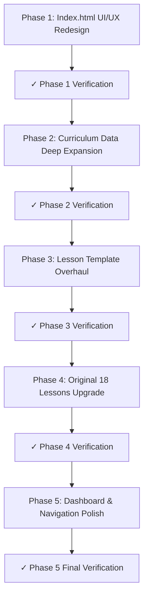

# CodeHub Complete Overhaul Plan — UI/UX, Content Depth & Lesson Quality

> **Audit Date:** August 31, 2026  
> **Audited by:** AI Content Auditor + UI/UX Design Analyzer  
> **Reference Design:** [Array Operations Lesson](https://ozidan13.github.io/algorithms/Week2/array_operations.html)

---

## 🚨 Critical Audit Findings

### Problem 1: Index.html UI/UX is Compact & Unreadable
- Track cards cram 10–18 lessons into tiny scrollable boxes with `max-height: 480px`
- Lesson items use `0.78rem` font for names and `0.67rem` for descriptions — too small to read
- Arabic text in `.lesson-desc` is truncated with `text-overflow: ellipsis` and `white-space: nowrap` — student cannot see what the lesson is about
- No lesson numbering, no difficulty level indicator, no time estimate visible
- Track cards have a "استعراض مسار بالكامل" footer link that is redundant when all lessons are already listed
- No breathing space between sections — everything is visually packed
- Missing Google Fonts for proper Arabic rendering (Cairo) — currently falls back to system fonts

### Problem 2: Lessons are Thin Template Skeletons (NOT "Zero to Hero")
- **Total teaching prose per lesson: ~150–250 words** (reads in 60–90 seconds, not the advertised 20–28 minutes)
- **Story/Context section:** Only 1 paragraph with 2–3 sentences
- **Mechanics steps:** Exactly 3 cards with 1 sentence each across ALL 106 lessons
- **Code anatomy:** Only 2–5 lines of code with brief notes
- **Quiz pool:** Exactly **1 question per lesson** (should be 4–6)
- **Playground code:** Trivial `console.log` scripts, even for HTML/CSS lessons that need DOM rendering
- **SVG diagrams:** Copy-pasted identical 3-box generic pipeline across all 106 lessons
- **Interactive stepper:** Empty `<div>` containers with no actual content
- **Mistakes gallery:** Only 1 bad/good pair per lesson
- **Interview Q&A:** Only 1 question per lesson

### Problem 3: Playground is Not Useful
- All 106 lessons use "JavaScript Console Mode" — even HTML, CSS, MongoDB, PostgreSQL, and Prisma lessons
- Code samples are toy `console.log` demos that don't teach anything real
- No HTML/CSS live preview mode, no SQL query runner, no React JSX renderer

---

## 📐 Reference Design Analysis (algorithms/array_operations.html)

Key design patterns we must adopt:

| Feature | Reference Design | Current CodeHub |
|:---|:---|:---|
| **Arabic Font** | Google Cairo (wght 400/600/800) | System fallback only |
| **English Font** | Google Inter (wght 400/600/800) | System fallback only |
| **Mono Font** | Google Fira Code | System fallback only |
| **Section Spacing** | `py-20` (80px vertical padding) | `var(--space-4)` (~16px) |
| **Heading Size** | `text-4xl` to `text-7xl` (2.25rem–4.5rem) | `var(--fs-md)` (~1rem) |
| **Card Style** | Glass-card with backdrop-filter blur(12px) | Minimal border, no blur |
| **RTL Blocks** | Explicit `.rtl-block { direction: rtl; text-align: right }` | Mixed LTR/RTL with inline styles |
| **Animations** | AOS (Animate on Scroll) library | Only CSS `opacity` fade-in |
| **Content Depth** | Multiple sub-sections with deep prose, examples, interactive demos | 1 paragraph + 3 step cards |
| **Interactive Demos** | Real animated array cell visualizers with state | Empty containers |
| **Lesson Layout** | Full-page immersive sections, each a viewport-height block | Compact stacked cards |

---

## 🏗️ Implementation Phases

### Phase 1: Index.html UI/UX Complete Redesign
**Scope:** Rebuild `index.html` from scratch with reference-quality design  
**Duration Estimate:** Large

#### 1.1 Typography & Fonts
- Add Google Fonts: `Cairo` (Arabic), `Inter` (English), `Fira Code` (code)
- Update `css/tokens.css` to use these fonts as `--font-arabic`, `--font-sans`, `--font-mono`
- Increase base Arabic font size to `1.1rem` with `line-height: 1.9`

#### 1.2 Track Section Redesign
- Remove the 4-column compact grid layout
- Each track becomes a **full-width section** with its own header, description, and spacious lesson grid
- Remove `max-height` scroll on lesson lists — show ALL lessons openly
- Remove the "استعراض مسار بالكامل ←" footer link from each track card (replaced by showing all lessons directly)

#### 1.3 Lesson Card Redesign
- Each lesson becomes a proper card with:
  - **Lesson number** (e.g., `01`, `02`, etc.)
  - **Full title** in English (no truncation)
  - **Full Arabic subtitle/description** (2–3 lines, no truncation, no `nowrap`)
  - **Estimated time** badge (e.g., `⏱ 25 min`)
  - **Difficulty level** indicator (Beginner / Intermediate / Advanced)
  - **Topic tags** (e.g., `HTTP`, `DNS`, `TLS`)
- Use glass-card effect with `backdrop-filter: blur(12px)`
- Minimum card width: `320px`, arranged in a responsive `auto-fill` grid

#### 1.4 Section Spacing & Visual Hierarchy
- Each track section: `padding-block: 80px` (like reference's `py-20`)
- Track section headers: `font-size: clamp(2rem, 4vw, 3rem)` with gradient text
- Alternating section backgrounds (slight tint variation) for visual rhythm
- AOS-like scroll reveal animations using CSS `IntersectionObserver`

#### 1.5 Search & Navigation
- Move search bar to a sticky top position
- Add track quick-jump navigation anchors

#### Verification & Review (Phase 1)
- [ ] Open `index.html` in browser and visually compare with reference design
- [ ] Verify all 106 lessons are visible without scrolling inside cards
- [ ] Verify Arabic text is readable at all viewport widths (320px–1920px)
- [ ] Verify no `text-overflow: ellipsis` or `white-space: nowrap` on lesson descriptions
- [ ] Run `node scripts/check-content.mjs` to ensure no regressions
- [ ] Screenshot comparison: before vs after
- [ ] Push to `main` and verify on GitHub Pages

---

### Phase 2: Curriculum Data Deep Content Expansion
**Scope:** Rewrite ALL 8 curriculum data modules in `scripts/curriculum-data/` with truly comprehensive content  
**Duration Estimate:** Very Large (this is the core educational work)

#### 2.1 Content Depth Requirements (Per Lesson)

Every lesson data object must contain:

| Field | Current State | Required State |
|:---|:---|:---|
| `problemOpening` | 1 paragraph (2–3 sentences) | **3–4 substantial paragraphs** covering: real-world scenario, why this matters in production, what happens without it, historical context |
| `mechanics` | 3 steps × 1 sentence | **5–7 steps × 2–3 sentences each** with code snippets embedded in descriptions |
| `codeAnatomy` | 2–5 lines | **12–25 lines** of real production code with detailed annotations |
| `playgroundCode` | ~10 lines trivial `console.log` | **20–40 lines** of meaningful, editable, educational code that demonstrates the concept |
| `experimentQuestion` | 1 sentence | **Detailed scenario** with code snippet for the student to analyze before running |
| `experimentAnswer` | 1 sentence | **Multi-paragraph deep explanation** with edge cases and "gotcha" details |
| `pitfallBad` / `pitfallGood` | 1 pair, 1 line each | **2–3 pairs** of anti-patterns vs best practices, each with multi-line real code |
| `pitfallDiagnosis` | 1 sentence | **Detailed engineering diagnosis** explaining WHY the bad pattern causes issues at scale |
| `quizPool` | 1 question | **4–6 varied questions**: conceptual, code-output prediction, debugging, edge cases |
| `interviewQ` / `interviewA` | 1 Q&A | **3 interview Q&As** covering junior, mid, and senior level perspectives |
| `glossary` | Not present | **5–8 key terms** with definitions |
| `furtherReading` | Not present | **3–4 curated references** (MDN, official docs, notable blog posts) |

#### 2.2 Track-Specific Playground Modes
- **Foundations (HTML/CSS lessons):** HTML/CSS live preview playground (iframe sandbox)
- **Foundations (JS lessons):** JavaScript console mode (current)
- **React lessons:** JSX pseudo-renderer with component state visualization
- **Node.js/Express lessons:** Terminal/API simulation mode
- **MongoDB lessons:** MongoDB query simulator
- **PostgreSQL lessons:** SQL query simulator
- **Prisma lessons:** Schema + generated client demo
- **Architecture lessons:** System design diagram interaction

#### 2.3 Execution Order
Rewrite curriculum data files in this order:
1. `foundations-lessons.mjs` (12 lessons)
2. `react-lessons-full.mjs` (14 lessons)
3. `nodejs-lessons.mjs` (11 lessons)
4. `express-lessons.mjs` (11 lessons)
5. `mongodb-lessons.mjs` (9 lessons)
6. `postgresql-lessons.mjs` (9 lessons)
7. `prisma-lessons.mjs` (9 lessons)
8. `architecture-lessons.mjs` (13 lessons)

#### Verification & Review (Phase 2)
- [ ] Each curriculum data file passes a new **content depth validator** script:
  - `problemOpening` ≥ 400 characters
  - `mechanics` array length ≥ 5
  - `codeAnatomy` array length ≥ 10
  - `quizPool` array length ≥ 4
  - `playgroundCode` length ≥ 300 characters
- [ ] Run `node scripts/generate-all-lessons.mjs` to regenerate all 88 lessons
- [ ] Run `node scripts/check-content.mjs` — 0 errors, 0 warnings
- [ ] Manually review 1 lesson from each track for educational quality
- [ ] Push to `main` after each track completion

---

### Phase 3: Lesson Template & HTML Generator Overhaul
**Scope:** Rebuild `scripts/generate-all-lessons.mjs` to produce richer, more immersive lesson pages  
**Duration Estimate:** Medium

#### 3.1 Template Structure Changes
- **Remove** the generic 3-box SVG diagram — replace with `data.diagram` field (per-lesson custom SVG or a proper architecture-specific diagram)
- **Expand** the Mistakes Gallery to render multiple mistake pairs (not just one)
- **Expand** the Quiz section to render all 4–6 questions with progressive reveal
- **Add** Glossary section with term cards grid
- **Add** Further Reading section with curated links
- **Add** Multiple Interview Q&A accordions (junior/mid/senior)
- **Improve** the Playground section:
  - Add mode selector (Console / DOM Preview / API Tester)
  - Add "Reset Code" button
  - Add "Copy Code" button
  - Pre-populate the output with a helpful hint message

#### 3.2 Visual Improvements to Lesson Pages
- Import Google Fonts (Cairo, Inter, Fira Code) in lesson template
- Increase section padding to `padding-block: 60px`
- Use glass-card style for callouts and step cards
- Add scroll-triggered animations to sections
- Improve code block syntax highlighting with line numbers

#### 3.3 Stepper Population
- The `data-fsa-stepper` containers must be populated with actual multi-step content from each lesson's `mechanics` data (not left empty)

#### Verification & Review (Phase 3)
- [ ] Regenerate all 88 lessons with the new template
- [ ] Run full 17-point quality gate
- [ ] Visually compare a lesson page with the reference design
- [ ] Verify fonts load correctly offline (check `css/tokens.css`)
- [ ] Run `node scripts/build-index-html.mjs` to rebuild index.html
- [ ] Push to `main`

---

### Phase 4: Existing 18 Lessons Content Upgrade
**Scope:** The 18 original hand-crafted lessons in `learn/` also need content depth upgrades  
**Duration Estimate:** Medium

#### 4.1 Files to Upgrade
```
learn/foundations/how-web-works.html
learn/foundations/js-essentials.html  (js-scope-closures)
learn/foundations/async-js.html       (js-async-promises)
learn/foundations/fetch-api.html      (js-fetch-api)
learn/react/thinking-in-react.html
learn/react/use-state.html
learn/react/use-effect.html
learn/react/reconciliation.html
learn/nodejs/what-node-is.html
learn/nodejs/event-loop.html
learn/nodejs/streams-buffers.html
learn/express/hello-express.html
learn/express/middleware.html
learn/express/rest-crud.html
learn/mongodb/document-model.html
learn/postgresql/relational-model.html
learn/prisma/what-is-an-orm.html
learn/architecture/request-lifecycles.html
```

#### 4.2 Upgrade Requirements
- Add more Arabic teaching prose (expand to 800+ words per lesson)
- Add more code examples and walkthroughs
- Add 4–6 quiz questions each
- Add multiple mistake pairs
- Add glossary terms
- Ensure consistent styling with the new template

#### Verification & Review (Phase 4)
- [ ] All 18 lessons pass the enhanced content depth validator
- [ ] Run full 17-point quality gate: 0 errors across 106 lessons
- [ ] Push to `main`

---

### Phase 5: Dashboard, Search & Navigation Polish
**Scope:** Final UX polish across the platform  
**Duration Estimate:** Small

#### 5.1 Dashboard Enhancements
- Track progress bars show accurate percentage
- Add lesson completion time tracking
- Add "Recent Activity" timeline

#### 5.2 Global Search Enhancement
- Search indexes lesson content, not just titles
- Fuzzy matching for Arabic terms
- Keyboard navigation (↑↓ to navigate, Enter to open)

#### 5.3 Lesson Navigation
- Add "Previous Lesson ←" and "→ Next Lesson" buttons at bottom of each lesson
- Add track progress indicator in lesson sidebar
- Add estimated reading progress bar

#### Verification & Review (Phase 5)
- [ ] Open each major page (index.html, dashboard.html, a lesson page, a project page)
- [ ] Verify navigation flows correctly between pages
- [ ] Run full CI-Lite pipeline: `check-content → gen-curriculum → build-search-index → build-track-pages → build-index-html`
- [ ] Final push to `main`
- [ ] Visual review on GitHub Pages deployment

---

## 📊 Summary: Phase Dependencies & Order



| Phase | Scope | Estimated Effort | Dependencies |
|:---|:---|:---|:---|
| **Phase 1** | `index.html` + CSS tokens + fonts | Medium | None |
| **Phase 2** | 8 curriculum data files (88 lessons) | **Very Large** | Phase 1 |
| **Phase 3** | Generator script + lesson template | Medium | Phase 2 |
| **Phase 4** | 18 original lessons content upgrade | Medium | Phase 3 |
| **Phase 5** | Dashboard, search, navigation polish | Small | Phase 4 |

---

> [!IMPORTANT]
> **This plan requires your explicit approval before any implementation begins.**  
> Please review each phase and confirm whether you want to proceed with all 5 phases or modify the scope.
