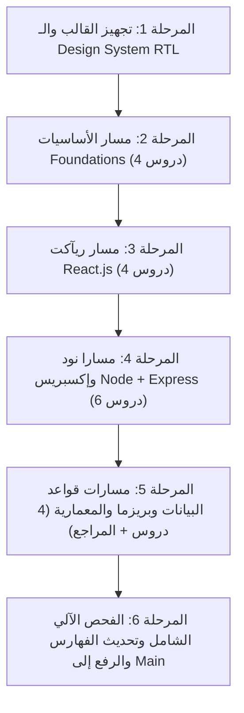

# FullStack Academy — Master Lesson Redesign & Humanized Storytelling Blueprint
# وثيقة الخطة التنفيذية الشاملة والمفصلة: السرد القصصي البشري والدمج اللغوي الكامل لجميع الدروس

---

## 🎯 الرؤية المعمارية والهدف الاستراتيجي (The Master Vision)

تحويل منصة **FullStack Academy** بالكامل من مجرد محتوى تقني مجزأ أو مترجم آلياً إلى **مرجع تعليمي هندسي تفاعلي بمستوى عالمي**، يعتمد على أسلوب كبار مهندسي البرمجيات في السرد القصصي الواقعي (Humanized Engineering Storytelling)، ويدمج اللغة العربية (باللهجة المصرية التقنية السلسة والمحببة) مع المصطلحات الإنجليزية القياسية في تدفق واحد مستمر وممتع، مستوحى مباشرة من المعايير البصرية والتفاعلية في [`style-reference/style-ref-01.html`](file:///d:/work/projects/mern/style-reference/style-ref-01.html) و [`style-reference/ref-index.html`](file:///d:/work/projects/mern/style-reference/ref-index.html).

---

## 💎 ميثاق السرد اللغوي والتربوي (The Pedagogical & Linguistic Charter)

### 1. الدمج الطبيعي الكامل (Natural Language Fusion)
* **لا أقسام مترجمة منفصلة**: يُمنع منعاً باتاً وضع فقرة بالإنجليزية ثم وضع ترجمتها بالعربية تحتها كأنها نصوص ذكاء اصطناعي.
* **الانسيابية اللغوية (Unified Flow)**: الشرح ينساب باللغة العربية الفصيحة المبسطة والمطعمة بالمصطلحات الهندسية الإنجليزية الدقيقة (مثل: `Call Stack`, `Event Loop`, `Fiber Node`, `Middleware Pipeline`, `ACID Transactions`) داخل نفس السطر مع عزل اتجاه النصوص برمجياً (`dir="ltr"`).
* **أسلوب "الدردشة الهندسية مع Senior Engineer"**:
  - الابتعاد عن الجمل الإنشائية الجافة والمقدمات التافهة.
  - البدء دائماً بالمشكلة الواقعية المؤلمة في الإنتاج (Production Pain Point).
  - توضيح كيف كان المهندسون يعانون قبل ابتكار هذه التقنية (Historical Context).
  - كشف لحظة الانفراجة والحل الذكي (The Engineering Breakthrough).
  - التحذير من الفخاخ الخفية التي يقع فيها 90% من المطورين (The Common Pitfalls).

### 2. جدول التشبيهات الواقعية الحية (The Real-World Analogy Matrix)

| المسار | المفهوم الهندسي | التشبيه الواقعي (Analogy) | الفكرة المستخلصة |
| :--- | :--- | :--- | :--- |
| **Foundations** | HTTP/3 & DNS Lifecycle | دليل الهاتف السريع ومندوب الشحن السريع | تحويل الاسم لعنوان IP رقمي والتسليم المتوازي دون اختناق |
| **Foundations** | V8 Call Stack & Closures | رئيس الطهاة في المطبخ ومكدس الأطباق وحقيبة الظهر | تنفيذ الدوال LIFO واحتفاظ الدالة الابنة بمتغيرات الأب |
| **Foundations** | Asynchronous Event Loop | كاشير مطعم الوجبات السريعة وجهاز التنبيه اللاسلكي | عدم تجميد الخيط الواحد واستدعاء الوعود فور جهوزيتها |
| **Foundations** | Fetch API & Streams | استلام الطرد البريدي وفتح الصندوق لتركيب الشاشة | استلام الترويسات أولاً ثم استهلاك التدفق الثنائي |
| **React 19** | Thinking in React | قلعة مكعبات الليجو وشجرة العائلة | تفكيك الواجهة لمكونات أحادية المسؤولية وتدفق الـ Props |
| **React 19** | useState & Fiber | الشخص فاقد الذاكرة وصناديق الأمانات المتسلسلة | تتبع الـ State عبر سلسلة عقد Fiber Linked List بالترتيب |
| **React 19** | useEffect & Cleanup | نزيل الفندق وجهاز التكييف الذكي | مزامنة الأنظمة الخارجية وتنظيف الموارد لمنع تسريب الذاكرة |
| **React 19** | Reconciliation & Keys | مسودة المهندس المعماري وأرقام جلوس الطلاب في الامتحان | مقارنة الـ VDOM في O(n) وتثبيت هوية المكونات بالمفاتيح |
| **Node.js** | Node Runtime & libuv | المدير الذكي وعمال الـ Thread Pool في المخزن | تفويض العمليات الثقيلة للـ C++ Worker Threads |
| **Node.js** | 6-Phase Event Loop | قطار المترو ذو المحطات الست والممر السريع | الترتيب الزمني لتفريغ المؤقتات والـ I/O و nextTick |
| **Node.js** | Streams & Backpressure | صنبور المياه وخزان الـ Buffer وصمام الأمان | معالجة الجيجابايت دون تفجير رام السيرفر |
| **Express.js** | Express 5 Architecture | مأمور البريد الذكي وفرز الرسائل | استقبال الطلبات وتوزيعها على المسارات وحل تصادم المنافذ |
| **Express.js** | Middleware Pipeline | بوابات التفتيش الأمني في المطار ودور دالة next() | تمرير الطلب عبر مراحل الفحص والتحقق ومعالجة الأخطاء |
| **Express.js** | REST CRUD API | أمين السجل المدني واستخراج الشهادات | معايير الـ HTTP Methods وأكواد الردود وفحص المدخلات |
| **MongoDB** | Document Model | المجلد الشامل لملف العميل في درج واحد | حفظ البيانات المترابطة في وثيقة BSON واحدة حتى 16MB |
| **PostgreSQL** | Relational Model & ACID | الخزنة البنكية الحصينة ذات الغرف المؤمنة | الحفاظ على سلامة المعاملات المالية عبر قيود ACID |
| **Prisma ORM** | Prisma Architecture | المترجم الفوري الصارم بين المبرمج وقاعدة البيانات | توفير Type Safety كامل ومنع أخطاء الـ SQL و N+1 |
| **Architecture** | End-to-End Request Flow | خط الإنتاج المتكامل من نقرة الزر إلى القرص الصلب | رحلة البيانات عبر الـ 4 طبقات والعودة للواجهة في 50ms |

---

## 🏛️ الهيكل القياسي للمحطات التسع لكل درس (The 9-Beat Lesson Standard)

يحتوي كل درس على 9 محطات متكاملة ومستقلة تماماً (Standalone Resource):

```
┌────────────────────────────────────────────────────────────────────────┐
│  Beat 1: المقدمة التفاعلية وأهداف الإتقان (Header, Meta & Objectives)  │
├────────────────────────────────────────────────────────────────────────┤
│  Beat 2: القصة الهندسية والتشبيه الواقعي (The Core Story & Analogy)    │
├────────────────────────────────────────────────────────────────────────┤
│  Beat 3: كيف يعمل المفهوم خطوة بخطوة (Step-by-Step Mechanics Cards)    │
├────────────────────────────────────────────────────────────────────────┤
│  Beat 4: الرؤية البصرية والمحاكي التفاعلي (Interactive Stepper + SVG)  │
├────────────────────────────────────────────────────────────────────────┤
│  Beat 5: جرب بنفسك في المتصفح (Web Worker Sandbox + Predict Puzzle)    │
├────────────────────────────────────────────────────────────────────────┤
│  Beat 6: تشريح الكود البرمجي سطراً بسطر (Interactive Code Anatomy)     │
├────────────────────────────────────────────────────────────────────────┤
│  Beat 7: كواليس هندسية وتحليل الأداء (Deep Dive, Big-O & Architecture) │
├────────────────────────────────────────────────────────────────────────┤
│  Beat 8: معرض الأخطاء الشائعة وقاموس المصطلحات (Mistakes Diff Gallery) │
├────────────────────────────────────────────────────────────────────────┤
│  Beat 9: اختبار الإتقان الفوري وأسئلة المقابلات (Checkpoint & QA)      │
└────────────────────────────────────────────────────────────────────────┘
```

---

## 🗺️ تفاصيل الدروس خطوة بخطوة عبر المراحل التنفيذية



---

### المرحلة 1: هندسة التصميم والقالب الموحد وضبط الـ RTL/LTR
* **الهدف**: ضبط البيئة التحتية لضمان عمل كل الصفحات بنظام RTL عربي نقي مع عزل كامل للأكواد الإنجليزية.
* **الملفات**:
  - [`templates/lesson-template.html`](file:///d:/work/projects/mern/templates/lesson-template.html): القالب الذهبي للمحطات التسع.
  - [`css/base.css`](file:///d:/work/projects/mern/css/base.css): ضبط عزل `unicode-bidi: isolate` للوسوم البرمجية `code`, `pre`, `kbd`, `span.fsa-en-code`.
  - [`css/learning.css`](file:///d:/work/projects/mern/css/learning.css): ضبط اتجاه الـ Steppers والـ Playgrounds والـ Diff Cards في الـ RTL.

---

### المرحلة 2: مسار أساسيات الويب وجافاسكربت (Foundations Track) — 4 دروس

#### 1. [`learn/foundations/how-web-works.html`](file:///d:/work/projects/mern/learn/foundations/how-web-works.html)
* **العنوان**: How the Web Works: HTTP/3 & DNS Lifecycle
* **القصة والتشبيه**: دليل الهاتف السريع ومأمور الشحن (Phonebook & Courier). رحلة البحث عن IP دومين `google.com` من كاش المتصفح إلى الـ Root والـ TLD والـ Authoritative، ثم مصافحة QUIC TLS 1.3 0-RTT السريعة.
* **المحاكي التفاعلي**: محاكي من 5 خطوات يوضح حركة الـ Request وحل النطاق واستلام أول بايت.
* **صندوق التجربة**: تفكيك كائن `new URL()` في جافاسكربت واستخراج البروتوكول والمنفذ والـ Hash.
* **لغز التوقع**: ماذا يحدث لـ `#hash` في الـ URL وهل يسافر للسيرفر؟ (الإجابة: مستحيل).
* **الأخطاء الشائعة**: الاعتقاد الخاطئ بأن DNS Lookup يحدث عند كل طلب Fetch (تصحيح: الـ OS Cache و Keep-Alive).
* **سؤال المقابلات**: الفرق بين الاستماع على `127.0.0.1` و `0.0.0.0` في بيئة العمل وتطبيقات Docker.

#### 2. [`learn/foundations/js-essentials.html`](file:///d:/work/projects/mern/learn/foundations/js-essentials.html)
* **العنوان**: JS Execution Context, Scope & Closures
* **القصة والتشبيه**: رئيس الطهاة في المطبخ ومكدس الأطباق (LIFO) وحقيبة الظهر السحرية للـ Closures.
* **المحاكي التفاعلي**: تتبع حركة دفع وحذف إطارات الدوال في الـ Call Stack مع محاكاة كارثة الـ Stack Overflow.
* **صندوق التجربة**: دالة `createCounter()` وحماية المتغير الخاص `count` من التعديل الخارجي.
* **لغز التوقع**: التمييز الدقيق بين `var` والـ Hoisting برفع `undefined`، و `let` في الـ Temporal Dead Zone (TDZ).
* **الأخطاء الشائعة**: فخ الـ `var` داخل حلقات `for` وحله بـ `let` لإنشاء Block Scope جديد لكل لفة.
* **سؤال المقابلات**: كيف تعمل الـ Closures في هوك `useState` داخل ريآكت؟

#### 3. [`learn/foundations/async-js.html`](file:///d:/work/projects/mern/learn/foundations/async-js.html)
* **العنوان**: Asynchronous JS: Event Loop & Promises
* **القصة والتشبيه**: كاشير مطعم الوجبات السريعة الذكي وجهاز التنبيه اللاسلكي (Pager Buzzer).
* **المحاكي التفاعلي**: أسبقية طوابير الـ Event Loop: تفريغ الـ Microtasks (وعود Promises) بالكامل قبل لمس أي مؤقت Macrotask (setTimeout).
* **صندوق التجربة**: كود تفاعلي يثبت عملياً أن `Promise.then` تسبق `setTimeout(0)` دائماً.
* **لغز التوقع**: ترتيب طباعة الأرقام بين الكود المتزامن والـ Microtask والـ Macrotask.
* **الأخطاء الشائعة**: فخ الـ Waterfall البطيء داخل الحلقات وحله بـ `Promise.all()` المتوازي.
* **سؤال المقابلات**: المقارنة الدقيقة بين `Promise.all` و `Promise.allSettled` و `Promise.race` و `Promise.any`.

#### 4. [`learn/foundations/fetch-api.html`](file:///d:/work/projects/mern/learn/foundations/fetch-api.html)
* **العنوان**: Fetch API, Streams & AbortController
* **القصة والتشبيه**: استلام الطرد البريدي (Headers) وفتح الصندوق لتركيب الشاشة (Streams Consumption).
* **المحاكي التفاعلي**: دورة حياة المرحلتين لطلب الشبكة وآلية قطع الاتصال عبر `AbortController`.
* **صندوق التجربة**: محاكاة طلب شبكة مع توقيت إلغاء فوري لمنع تسريب الموارد.
* **لغز التوقع**: لماذا لا تفشل دالة `fetch` عند استلام كود 404 أو 500؟ (لأن الترويسات وصلت بنجاح ويجب فحص `res.ok`).
* **الأخطاء الشائعة**: محاولة قراءة الـ Response مرتين (`res.json()` ثم `res.text()`) وخطأ Body Locked.
* **سؤال المقابلات**: كيفية ربط `AbortController` مع `useEffect` في ريآكت لمنع الـ Memory Leaks.

---

### المرحلة 3: مسار ريآكت الحديثة (React 19 Track) — 4 دروس

#### 1. [`learn/react/thinking-in-react.html`](file:///d:/work/projects/mern/learn/react/thinking-in-react.html)
* **العنوان**: Thinking in React: Component Hierarchy & State Flow
* **القصة والتشبيه**: قلعة مكعبات الليجو وشجرة العائلة (Lego Blocks & Family Tree).
* **المحاكي التفاعلي**: تفكيك الواجهة لشجرة مكونات وتدفق الـ Props للأبناء ورفع الحالة (Lifting State Up).
* **صندوق التجربة**: دالة نقية تستقبل Props وترجع شارة المنتج بدون أي تعديل خارجي.
* **لغز التوقع**: أين نضع الـ State عندما يحتاجها مكونان شقيقان؟ (في الأب المشترك الأقرب).
* **الأخطاء الشائعة**: محاولة تعديل كائن الـ Props مباشرة داخل المكون الفرعي وحله بدوال الـ Callbacks.
* **سؤال المقابلات**: ما هو الـ Prop Drilling وما هي الحلول الثلاثة الإنتاجية لحله؟

#### 2. [`learn/react/use-state.html`](file:///d:/work/projects/mern/learn/react/use-state.html)
* **العنوان**: useState Hook: Fiber Linked Lists & Immutability
* **القصة والتشبيه**: الشخص فاقد الذاكرة وصناديق الأمانات المتسلسلة (Linked Lockers).
* **المحاكي التفاعلي**: سلسلة الـ Hooks المتصلة داخل كائن الـ Fiber Node وسبب قدسية ترتيب الاستدعاء.
* **صندوق التجربة**: محاكاة طابور التحديثات والـ Automatic Batching ودوال الـ Updater Functions.
* **لغز التوقع**: نتيجة استدعاء `setCount(count + 1)` ثلاث مرات متتالية (النتيجة 1 وليس 3).
* **الأخطاء الشائعة**: التعديل المباشر للمصفوفة `arr.push()` دون تغيير المرجع في الذاكرة.
* **سؤال المقابلات**: متى نفضل استخدام `useReducer` بدلاً من `useState`؟

#### 3. [`learn/react/use-effect.html`](file:///d:/work/projects/mern/learn/react/use-effect.html)
* **العنوان**: useEffect Hook: Synchronization & Cleanup
* **القصة والتشبيه**: نزيل الفندق وجهاز التكييف الذكي (The Hotel Guest & AC).
* **المحاكي التفاعلي**: تشغيل دالة الـ Cleanup الخاصة بالـ Render السابق قبل تشغيل الـ Effect الجديد.
* **صندوق التجربة**: محاكاة الاشتراك في غرفة محادثة مع فصل الاتصال القديم عند تبديل الغرفة.
* **لغز التوقع**: كم مرة يشتغل الـ Effect بمصفوفة اعتماديات فارغة `[]` في الإنتاج؟ (مرة واحدة عند الـ Mount).
* **الأخطاء الشائعة**: نسيان دالة التنظيف مع التايمرز (`clearInterval`) وتسريب الذاكرة.
* **سؤال المقابلات**: متى يجب الامتناع عن استخدام `useEffect` واستبدالها بحسابات نقية أو TanStack Query؟

#### 4. [`learn/react/reconciliation.html`](file:///d:/work/projects/mern/learn/react/reconciliation.html)
* **العنوان**: Reconciliation: Virtual DOM & Diffing Algorithm
* **القصة والتشبيه**: مسودة المهندس المعماري وأرقام جلوس الطلاب في الامتحان (Blueprint & Seat Numbers).
* **المحاكي التفاعلي**: مقارنة شجرتي VDOM في O(n) واكتشاف التعديل الدقيق وتطبيقه في الـ Real DOM.
* **صندوق التجربة**: مطابقة عناصر القائمة عبر المفاتيح الثابتة واكتشاف العنصر الجديد فورياً.
* **لغز التوقع**: كم عنصر يعاد رسمه عند إضافة عنصر في أول القائمة مع `key={index}`؟ (القائمة كلها!).
* **الأخطاء الشائعة**: استخدام `Math.random()` كمفتاح للقائمة وتدمير أداء الواجهة.
* **سؤال المقابلات**: الفرق بين `React.memo` (لمنع رسم المكون) و `useMemo` (لحفظ قيمة حسابية).

---

### المرحلة 4: مسارا نود وإكسبريس (Node.js & Express.js) — 6 دروس

#### 1. [`learn/nodejs/what-node-is.html`](file:///d:/work/projects/mern/learn/nodejs/what-node-is.html)
* **العنوان**: What Node.js Is: V8 & libuv Architecture
* **القصة والتشبيه**: المدير الذكي وعمال الـ Thread Pool في المخزن (Manager & Warehouse Crew). نود جي إس ليست لغة برمجة، بل بيئة تشغيل C++ تدمج محرك V8 مع مكتبة libuv لإدارة العمليات غير المتزامنة.
* **المحاكي التفاعلي**: تتبع تفويض قراءة الملفات من الـ Main Thread إلى عمال الـ libuv Thread Pool الأربعة ثم إعادة النتيجة.
* **صندوق التجربة**: فحص حجم الـ Thread Pool التلقائي `UV_THREADPOOL_SIZE` وتشغيل عمليات التشفير بالتوازي.
* **لغز التوقع**: هل استدعاء `fs.readFile` يشغل خيط جافاسكربت الرئيسي؟ (لا، يفوض لـ libuv).
* **الأخطاء الشائعة**: تشغيل عمليات حسابية ثقيلة (CPU-bound) على الـ Main Thread وتجميد الخادم بالكامل.
* **سؤال المقابلات**: كيف تخدم نود جي إس بخيط واحد 100 ألف طلب متزامن بدون انهيار؟

#### 2. [`learn/nodejs/event-loop.html`](file:///d:/work/projects/mern/learn/nodejs/event-loop.html)
* **العنوان**: The 6-Phase Node.js Event Loop
* **القصة والتشبيه**: قطار المترو ذو المحطات الست والممر السريع VIP (The 6-Station Metro & VIP Pass).
* **المحاكي التفاعلي**: جولة تفاعلية في المراحل الست: Timers &rarr; Pending Callbacks &rarr; Idle/Prepare &rarr; Poll Phase &rarr; Check Phase (`setImmediate`) &rarr; Close Callbacks.
* **صندوق التجربة**: المقارنة العملية بين `process.nextTick` و `setImmediate` داخل سياق الـ I/O Cycle.
* **لغز التوقع**: من ينفذ أولاً: `setImmediate` أم `setTimeout(0)` عند تشغيلهما داخل `fs.readFile`؟ (الإجابة: `setImmediate` دائماً لأن دورة الـ Poll تليها مرحلة الـ Check فوراً).
* **الأخطاء الشائعة**: استخدام `process.nextTick` بشكل متكرر وتجويع الـ Event Loop (Starvation).
* **سؤال المقابلات**: ما هو الفرق الدقيق بين Event Loop في المتصفح و Event Loop في Node.js؟

#### 3. [`learn/nodejs/streams-buffers.html`](file:///d:/work/projects/mern/learn/nodejs/streams-buffers.html)
* **العنوان**: Streams, Buffers & Backpressure Management
* **القصة والتشبيه**: صنبور المياه وخزان الـ Buffer وصمام الأمان (Water Tap & Safety Valve).
* **المحاكي التفاعلي**: تدفق البيانات في أجزاء Chunks عبر الـ Buffer ومراقبة حد الـ `highWaterMark` وتفعيل إشارة `drain`.
* **صندوق التجربة**: قراءة وتمرير ملف ضخم عبر `createReadStream.pipe(createWriteStream)` مع مراقبة استهلاك الرام.
* **لغز التوقع**: ماذا يحدث لو كان تيار القراءة أسرع 10 أضعاف من تيار الكتابة دون إدارة الـ Backpressure؟ (تضخم الرام وانهيار السيرفر بـ Out of Memory).
* **الأخطاء الشائعة**: استخدام `fs.readFileSync` لقراءة ملفات المستخدمين في بيئة الإنتاج.
* **سؤال المقابلات**: ما هي الأنواع الأربعة للـ Streams في Node.js (Readable, Writable, Duplex, Transform)؟

#### 4. [`learn/express/hello-express.html`](file:///d:/work/projects/mern/learn/express/hello-express.html)
* **العنوان**: Hello Express: Server Architecture & Routing
* **القصة والتشبيه**: مأمور البريد الذكي وفرز الرسائل (The Postal Router).
* **المحاكي التفاعلي**: إنشاء الخادم، ربط المسارات بالـ HTTP Methods، وتوزيع الطلبات حسب الـ Path.
* **صندوق التجربة**: إعداد خادم Express 5.2 مع مسار تجريبي وفحص الـ Headers والـ JSON Response.
* **لغز التوقع**: ماذا يحدث عند تشغيل خادمين على نفس المنفذ (Port 3000)؟ (رمي خطأ `EADDRINUSE` وكيفية معالجته برمجياً).
* **الأخطاء الشائعة**: نسيان استدعاء `res.send()` أو `res.json()` وترك العميل معلقاً حتى الـ Timeout.
* **سؤال المقابلات**: ما هي التحسينات الجوهرية في Express 5 مقارنة بـ Express 4 (دعم الـ Promises التلقائي في الـ Route Handlers)؟

#### 5. [`learn/express/middleware.html`](file:///d:/work/projects/mern/learn/express/middleware.html)
* **العنوان**: Middleware Conveyor Pipeline & Error Guards
* **القصة والتشبيه**: بوابات التفتيش الأمني في المطار ودور دالة next() (Airport Security Gates).
* **المحاكي التفاعلي**: خط سير الطلب عبر Middleware التوثيق &rarr; التحقق من البيانات &rarr; معالج المسار &rarr; حارس الأخطاء المركزي (4 Parameters).
* **صندوق التجربة**: كتابة Middleware لحساب زمن استجابة الطلب (Response Time Logger) وتمريره بـ `next()`.
* **لغز التوقع**: ماذا يحدث لو نسيت استدعاء `next()` ولم ترسل رداً بـ `res`؟ (الطلب يقف مشلولاً في منتصف خط السير).
* **الأخطاء الشائعة**: كتابة حارس الأخطاء بثلاث معاملات فقط فيتعامل معه Express كـ Middleware عادي ولا يلتقط الاستثناءات.
* **سؤال المقابلات**: كيف تنظم الـ Middlewares لمنع هجمات الأمان الشائعة عبر حزم `helmet` و `cors` و `express-rate-limit`؟

#### 6. [`learn/express/rest-crud.html`](file:///d:/work/projects/mern/learn/express/rest-crud.html)
* **العنوان**: Production REST CRUD API & Validation
* **القصة والتشبيه**: أمين السجل المدني واستخراج الشهادات (Civil Registry Office).
* **المحاكي التفاعلي**: مصفوفة عمليات الـ CRUD الأربعة (Create, Read, Update, Delete) مع أكواد الحالة القياسية (201 Created, 204 No Content, 400 Bad Request, 404 Not Found).
* **صندوق التجربة**: محاكاة إضافة وتعديل وحذف مستخدمين مع التحقق من صحة البريد الإلكتروني وكلمة المرور.
* **لغز التوقع**: ما هو الفرق الهندسي بين استخدام `PUT` (استبدال المورد كاملاً) و `PATCH` (تعديل حقول محددة فقط)؟
* **الأخطاء الشائعة**: إرجاع كود 200 OK عند حدوث خطأ وكتابة رسالة الخطأ داخل الـ JSON (كسر معايير الـ REST).
* **سؤال المقابلات**: ما هي الـ Idempotency في بروتوكول HTTP وأي الأفعال تعتبر Idempotent؟ (GET, PUT, DELETE هي Idempotent، بينما POST ليست كذلك).

---

### المرحلة 5: قواعد البيانات وبريزما والمعمارية — 4 دروس ومراجع

#### 1. [`learn/mongodb/document-model.html`](file:///d:/work/projects/mern/learn/mongodb/document-model.html)
* **العنوان**: MongoDB Document Model: BSON & Embedding Patterns
* **القصة والتشبيه**: المجلد الشامل لملف العميل في درج واحد مقابل الجداول المتناثرة (All-in-One Folder).
* **المحاكي التفاعلي**: المقارنة البصرية بين وثيقة BSON مدمجة (Embedded Comments) ومراجع الوثائق (Referenced IDs).
* **صندوق التجربة**: بناء استعلامات تجميع Aggregation Pipeline عبر مراحل `$match` ثم `$group` ثم `$sort`.
* **لغز التوقع**: ما هو الحد الأقصى لحجم وثيقة BSON الواحدة في MongoDB ولماذا وضع هذا الحد؟ (16MB لمنع استهلاك الرام العشوائي).
* **الأخطاء الشائعة**: تضمين مصفوفات لا نهائية (Unbounded Arrays) داخل الوثيقة مما يؤدي لانفجار حاجز الـ 16MB.
* **سؤال المقابلات**: متى تختار التضمين (Embedding) ومتى تختار الإسناد (Referencing) في تصميم مخطط NoSQL؟

#### 2. [`learn/postgresql/relational-model.html`](file:///d:/work/projects/mern/learn/postgresql/relational-model.html)
* **العنوان**: PostgreSQL Relational Model & ACID Guarantees
* **القصة والتشبيه**: الخزنة البنكية الحصينة ذات الغرف المؤمنة (The Bank Vault & Ledger).
* **المحاكي التفاعلي**: محاكاة معاملة تحويل بنكي بين حسابين وتطبيق ضمانات ACID الأربعة لضمان إما نجاح العملية كاملة أو التراجع الكامل (Rollback).
* **صندوق التجربة**: تنفيذ استعلامات الدمج SQL Joins (INNER, LEFT, FULL) وتوضيح السجلات المستبعدة.
* **لغز التوقع**: ماذا يحدث لو انقطعت الكهرباء عن السيرفر في منتصف معاملة بنكية بعد خصم الرصيد وقبل إيداعه؟ (استرداد الحالة السابقة فورياً عبر Write-Ahead Logging WAL).
* **الأخطاء الشائعة**: نسيان إنشاء فهارس (Indexes) على الأعمدة المستخدمة في الـ Foreign Keys والـ WHERE clauses.
* **سؤال المقابلات**: ما هي مستويات عزل المعاملات الأربعة (Read Uncommitted, Read Committed, Repeatable Read, Serializable)؟

#### 3. [`learn/prisma/what-is-an-orm.html`](file:///d:/work/projects/mern/learn/prisma/what-is-an-orm.html)
* **العنوان**: Prisma 7: Type-Safe Rust Query Engine & Migrations
* **القصة والتشبيه**: المترجم الفوري الصارم بين المبرمج وقاعدة البيانات (The Strict Translator).
* **المحاكي التفاعلي**: تدفق كود TypeScript عبر عميل Prisma &rarr; محرك Rust Query Engine &rarr; توليد SQL محسّن &rarr; قاعدة البيانات.
* **صندوق التجربة**: كتابة استعلام Prisma آمن مع تضمين العلاقات عبر `include` واختيار الحقول بـ `select`.
* **لغز التوقع**: كيف تمنع Prisma كارثة استعلامات N+1 الشهيرة عند جلب المستخدمين ومقالاتهم؟ (تجميع الاستعلامات تلقائياً عبر IN query).
* **الأخطاء الشائعة**: تعديل قاعدة البيانات مباشرة بدون تسجيل Migration في مجلد `prisma/migrations`.
* **سؤال المقابلات**: كيف يتعامل مهندس الـ Senior مع تشخيص أخطاء Prisma الشهيرة مثل P2002 (Unique constraint failed) و P2025 (Record not found)؟

#### 4. [`learn/architecture/request-lifecycles.html`](file:///d:/work/projects/mern/learn/architecture/request-lifecycles.html)
* **العنوان**: End-to-End Full-Stack Request Lifecycle
* **القصة والتشبيه**: خط الإنتاج المتكامل من نقرة الزر إلى القرص الصلب (The End-to-End Assembly Line).
* **المحاكي التفاعلي**: المحاكي الأكبر في المنصة: تتبع رحلة زر "شراء الآن": React Component &rarr; Fetch API &rarr; HTTP/3 QUIC &rarr; Express Router &rarr; Auth Middleware &rarr; Prisma ORM &rarr; PostgreSQL Transaction &rarr; Response JSON &rarr; VDOM Diff &rarr; DOM Paint.
* **صندوق التجربة**: قياس زمن كل مرحلة من مراحل الطلب في الـ Performance Waterfall.
* **لغز التوقع**: ما هي الطبقة المسؤولة عن التحقق من صلاحيات المستخدم وهل نعتمد على تحقق الواجهة الأمامية؟ (الباك إند دائماً لأن الواجهة يمكن تزييفها).
* **الأخطاء الشائعة**: خلط منطق الأعمال (Business Logic) داخل الـ Controllers بدلاً من استخدام المعمارية ثلاثية الطبقات (Controller - Service - Repository).
* **سؤال المقابلات**: كيف تصمم معمارية تطبيق تجارة إلكترونية يتحمل مليون مستخدم متزامن (Caching مع Redis، CDN، Database Indexing & Read Replicas)؟

---

### المرحلة 6: الفحص الآلي الشامل وبناء الفهارس (Validation & Indexing)
1. **فحص الجودة الآلي**: تشغيل `node scripts/check-content.mjs` والتأكد من مطابقة جميع الدروس لمعايير الجودة الـ 17 بنسبة 0 تحذيرات (0 warnings).
2. **توليد الكتالوج المركزي**: تشغيل `node scripts/gen-curriculum.mjs` لتحديث بيانات `data/curriculum.js`.
3. **تحديث محرك البحث الذكي**: تشغيل `node scripts/build-search-index.mjs` لبناء فهرس البحث المرجح للغة العربية.
4. **الرفع إلى Remote Main**: عمل Git Commit و Push لجميع التعديلات على مستودع GitHub.

---

## 🔍 جدول معايير الجودة والتحقق (Quality & QA Metrics)

| المعيار | الشرط الإلزامي | آلية القياس والتحقق |
| :--- | :--- | :--- |
| **الدمج اللغوي والسرد** | انسيابية عربية مصرية مع مصطلحات إنجليزية بدون أقسام مفصولة | المراجعة النصية الدقيقة لكل درس |
| **التشغيل المستقل 100% Offline** | العمل بدون خادم محلي أو اتصال إنترنت (بروتوكول `file://`) | فتح الصفحات بدون إنترنت والتأكد من عمل الأيقونات والخطوط |
| **المحاكيات التفاعلية** | عمل الـ Stepper والـ Playground والـ Quiz في كل درس | التجربة المباشرة في المتصفح وتعديل الأكواد |
| **الفحص الآلي CI-Lite** | اجتياز جميع الفحوصات بـ 0 أخطاء و 0 تحذيرات | `node scripts/check-content.mjs` -> Code 0 (0 warnings) |
| **الأمان وسرعة الاستجابة** | زمن تحميل أولي أقل من 50ms وتشغيل الـ Playgrounds في Web Workers | فحص الأداء المحلي في أدوات المطورين DevTools |
